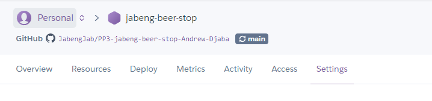
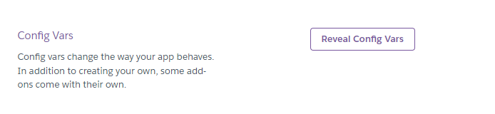
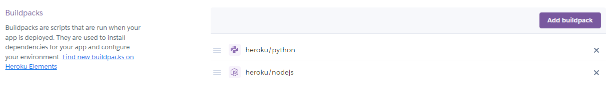
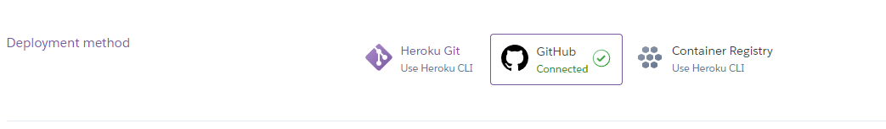

# Jabeng Beer Stop Data Automation

## Table of Contents

- [Overview](#overview)
- [Purpose](#purpose)
- [Features](#features)
  * ##### [Collect Sales Data](#collect-sales-data)
  * ##### [Validate Input](#validate-input)
  * ##### [Update Worksheets](#update-worksheets)
  * ##### [Calculate Surplus](#calculate-surplus)
  * ##### [Calculate Stock Levels](#calculate-stock-levels)
  * ##### [Retrieve and Display Stock Values](#retrieve-and-display-stock-values)

- [Technologies Used](#technologies-used)
- [Requirements](#requirements)
- [Setup](#setup)
  * ##### [Clone the Repository](#clone-the-repository)
  * ##### [Install Dependencies](#install-dependencies)
  * ##### [Setup Google Cloud Credentials](#setup-google-cloud-credentials)
  * ##### [Create and configure Google Sheets](#create-and-configure-google-sheets)

- [Usage](#usage)
  * [Programm Flow](#program-flow)
- [Functions](#functions)
- [Flowchart](#flowchart)
- [Testing](#testing)
- [Deployment](#deployment)
- [Future Enhancements](#future-enhancements)
- [Acknowledgements](#acknowledgements)

## Overview

The Jabeng Beer Stop Data Automation app is designed to streamline and automate the process of managing sales and inventory data for a beer store. Its primary purpose is to simplify the collection, validation, and analysis of sales data, ultimately leading to more efficient inventory management and better business decision-making. Here’s a breakdown of its key purposes:

## Purpose

1. #### Efficient Data Collection and Entry
   The app facilitates the efficient collection and entry of sales data. Instead of manually recording sales figures, the user can input the data directly into the app, which then processes and stores the information in Google Sheets. This reduces the risk of human error and saves time.

2. #### Data Validation
   The app includes robust data validation features to ensure that the input data is accurate and correctly formatted. This helps in maintaining the integrity of the data, ensuring that subsequent calculations and analyses are based on reliable information.

3. #### Automated Surplus Calculation
   The app automates the calculation of surplus for each type of beer. Surplus is determined by comparing the sales data with the stock data. This helps in identifying overstocked or understocked items, enabling the store to adjust its inventory levels accordingly.

4. #### Stock Level Management
   By calculating the average sales over the last five markets, the app can provide recommendations for optimal stock levels. It helps in maintaining a balanced inventory, ensuring that popular items are always in stock while minimizing the storage of less popular items.

5. #### Stock Recommendations
   The app provides stock recommendations based on historical sales data. By analyzing past sales, it helps the store owner to forecast future demand and adjust the stock levels proactively, thus preventing stockouts and overstock situations.

6. #### Data Storage and Retrieval
   Using Google Sheets for data storage ensures that the sales and inventory data is securely stored and easily accessible. The app can retrieve and display current stock levels and other relevant information, making it easy for the store owner to review and manage the inventory.

7. #### Improved Decision-Making
   By providing accurate and up-to-date data, the app helps the store owner make informed decisions about purchasing, stocking, and sales strategies. This can lead to increased efficiency, reduced costs, and improved customer satisfaction.

8. #### User-Friendly Interface
   The app provides a simple and intuitive interface for data entry and analysis. This makes it easy for users with limited technical expertise to use the app effectively.

## Features

* #### Collect Sales Data: 
    Prompt the user to enter sales data for six different beer types.

* #### Validate Input: 
    Ensure that the input data is valid and correctly formatted.

* #### Update Worksheets: 
  Append sales and surplus data to the relevant Google Sheets worksheets.

* #### Calculate Surplus:
   Determine the surplus for each beer type based on sales and stock data.

* #### Calculate Stock Levels: 
  Compute new stock levels based on average sales from the last five markets.

* #### Retrieve and Display Stock Values: 
  Fetch beer type headings and current stock values, displaying them in a user-friendly format.

## Technologies Used

* Python - used to provide functionality to the app.

* [Google Sheets](https://workspace.google.com/products/sheets/) - used to host application data

* [Gitpod](https://www.gitpod.io/) - used to create code and content for the repository.

* [Github](https://github.com/) - used to host the repository

* [draw.io](https://app.diagrams.net/) - used to create the flowchart in the planning stages. 

## Requirements

* Python 3.x

* `gspread` library

* `google-auth` library

* Google Cloud project with Google Sheets API enabled

* `creds.json`  file containing your Google Cloud credentials

## Setup

1. #### Clone the repository.

2. #### Install dependencies:
   `pip install gspread google-auth`

3. #### Setup Google Cloud credentials:
   
    *   Ensure you have a `creds.json` file with your Google Cloud credentials.
    *   Place this file in the project root directory.

4. #### Create and configure Google Sheets:

   * Create a Google Sheet named `jabeng_beer_stop`.
   * Create worksheets named ``sales``, ``surplus``, and ``stock``.
   * Ensure the first row of the ``stock`` worksheet contains beer type headings.

## Usage

Run the script by executing the following command:

``python run.py``

### Program Flow

1. #### Start

2. #### Collect Sales Data:
   * Prompt the user for sales data of six beer types.
   * Validate the input.

3. #### Append Sales Data to Worksheet:
   * Convert sales data to integers.
   * Append the data to the ``sales`` worksheet.

4. #### Calculate Surplus:
   * Calculate the surplus for each beer type based on the stock.
   * Append the surplus data to the ``surplus`` worksheet.

5. #### Calculate Average Sales:
   * Retrieve the last 5 entries of sales data.
   * Calculate the average sales for each beer type.

6. #### Calculate Stock Recommendations:
   * Use the average sales to calculate new stock levels.
   * Append the new stock data to the ``stock`` worksheet.

7. #### Retrieve and Display Stock Values:
   * Retrieve beer type headings.
   * Build a dictionary of stock values.
   * Print the stock values dictionary.

8. #### End   

## Functions

* ``get_sales_data()``: Collects sales data from the user.

* ``validate_data(values)``: Validates the sales data input.

* ``update_worksheet(data, worksheet)``: Updates the specified worksheet with the provided data.

* ``calculate_surplus_data(sales_row)``: Calculates the surplus for each item type.

* ``get_last_5_entries_sales()``: Retrieves the last 5 entries for each beer type from the sales worksheet.

*  ``calculate_stock_data(data)``: Calculates the average stock for each item type, adding 10%.

* ``get_stock_values(stock_values)``: Retrieves beer type headings and builds a dictionary with stock values.

* ``main()``: Runs all program functions in sequence.`

## Flowchart

 

## Testing

I checked my code by installing pep8 `pip3 install autopep8` and got no errors after testing. 

I also checked my code again on [Python code checker](https://www.pythonchecker.com/) with no errors to report. 

## Deployment
* The project was deployed to [heroku](https://www.heroku.com/). First we create a new app on the Heroku Dashboard.

* After the App is created, head over to the settings tab and create a Config Var and add a KEY called CREDS and its contents as it's VALUE. The template code used will use this information to create a file called creds.json and write  this data into it as the application is built. 

* The next step is to add a couple of  buildpacks to the application.
Scroll down and click the “Add buildpack” here. Select Python as the first  buildpack and then select node.js as the next buildpack to handle the mock terminal.

* Next we select the deploy tab to choose the method with which we want to deploy.

* Select Github and confirm that we want to connect.

* Search for the repository name and connect

## Future Enhancements
Enhancing the Jabeng Beer Stop Data Automation app can make it more robust, user-friendly, and feature-rich. Here are several potential improvements:

1. #### User Authentication and Authorization
   Login System: Implement a user authentication system to ensure that only authorized personnel can access and modify the data.
Role-Based Access Control: Define different user roles (e.g., admin, manager, employee) with specific permissions to access certain features or data.

2. #### Enhanced Data Validation and Error Handling
   Input Suggestions: Provide suggestions or dropdowns for beer types to minimize input errors.
Detailed Error Messages: Enhance error messages to provide more detailed feedback on why data is invalid and how to correct it.

3. #### Advanced Analytics and Reporting
   Sales Trends Analysis: Include features for visualizing sales trends over time using graphs and charts.
Predictive Analytics: Use machine learning algorithms to predict future sales and stock requirements based on historical data.
Custom Reports: Allow users to generate custom reports based on various parameters such as date range, beer type, etc.

4. #### Inventory Management Features
   Reorder Alerts: Implement automatic alerts for when stock levels fall below a certain threshold.
Batch Tracking: Track batches of beer for quality control and recall management.

5. #### User Interface Enhancements
   GUI Version: Develop a graphical user interface (GUI) to make the app more user-friendly.
Mobile App: Create a mobile version of the app for on-the-go access and data entry.

6. #### Integration with Other Systems
   Point of Sale (POS) Integration: Integrate the app with the store’s POS system to automatically update sales data in real-time.
Accounting Software Integration: Sync data with accounting software for seamless financial management.

7. #### Improved Data Visualization
   Dashboard: Create a dashboard that provides a real-time overview of key metrics such as current stock levels, daily sales, and surplus.
Interactive Charts: Use interactive charts and graphs to visualize data trends and patterns.

8. #### Enhanced Data Management
   Data Backup and Recovery: Implement automatic data backup and recovery features to prevent data loss.
Data Export: Allow users to export data to various formats (e.g., CSV, Excel, PDF) for offline analysis.

9. ####  Notifications and Alerts
   Email/SMS Alerts: Send email or SMS notifications for important events, such as low stock alerts or sales milestones.
In-App Notifications: Provide real-time in-app notifications for critical updates.

10. #### User Support and Documentation
    Help Center: Include a help center with FAQs, tutorials, and user guides.
Customer Support: Provide a way for users to contact customer support directly from the app.

11. #### Localization and Internationalization
    Multiple Languages: Support multiple languages to cater to a broader audience.
Currency Conversion: Include features for currency conversion if the app is used in multiple regions.

12. #### Scalability and Performance
    Optimized Performance: Optimize the app for faster data processing and retrieval.
    Scalability: Ensure the app can handle increased data loads as the business grows.

#### Summary
    By incorporating these improvements, the Jabeng Beer Stop Data Automation app can become a comprehensive tool for managing sales and inventory, providing valuable insights, and enhancing overall business efficiency. These enhancements will make the app more versatile, user-friendly, and capable of meeting the evolving needs of the business.

## Acknowledgments

* [gspread](https://github.com/burnash/gspread)

* [Google Auth Library](https://github.com/googleapis/google-auth-library-python)

* [Love Sandwiches Walkthrough project by Code Institute](https://bit.ly/3zyJce8) 

* [Code Institue](https://bit.ly/3zyJce8) Tutor Assisstant

