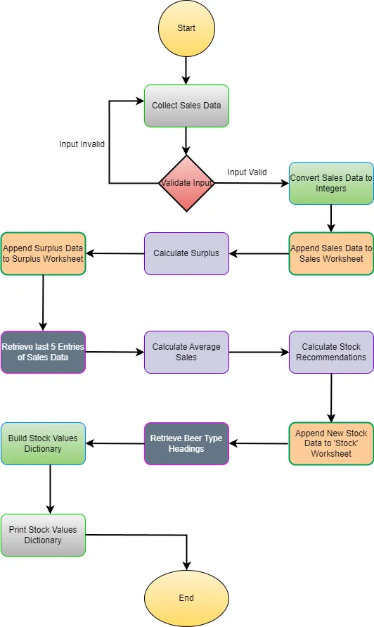

# Jabeng Beer Stop Data Automation

## Overview

The Jabeng Beer Stop Data Automation project is designed to streamline the process of collecting and managing sales data for a beer store. The program automates data entry, calculates surplus, updates stock levels, and provides stock recommendations for six beer types.

## Features

* #### Collect Sales Data: 
    Prompt the user to enter sales data for six different beer types.

* #### Validate Input: 
    Ensure that the input data is valid and correctly formatted.

* #### Update Worksheets: 
  Append sales and surplus data to the relevant Google Sheets worksheets.

* #### Calculate Surplus:
   Determine the surplus for each beer type based on sales and stock data.

* #### Calculate Stock Levels: 
  Compute new stock levels based on average sales from the last five markets.

* #### Retrieve and Display Stock Values: 
  Fetch beer type headings and current stock values, displaying them in a user-friendly format.

## Requirements

* Python 3.x

* `gspread` library

* `google-auth` library

* Google Cloud project with Google Sheets API enabled

* `creds.json`  file containing your Google Cloud credentials

## Setup

1. #### Clone the repository:

2. #### Install dependencies:
   `pip install gspread google-auth`

3. #### Setup Google Cloud credentials:
   
    *   Ensure you have a `creds.json` file with your Google Cloud credentials.
    *   Place this file in the project root directory.

4. #### Create and configure Google Sheets:

   * Create a Google Sheet named `jabeng_beer_stop`.
   * Create worksheets named ``sales``, ``surplus``, and ``stock``.
   * Ensure the first row of the ``stock`` worksheet contains beer type headings.

## Usage

Run the script by executing the following command:

``python run.py``

### Program Flow

1. #### Start

2. #### Collect Sales Data:
   * Prompt the user for sales data of six beer types.
   * Validate the input.

3. #### Append Sales Data to Worksheet:
   * Convert sales data to integers.
   * Append the data to the ``sales`` worksheet.

4. #### Calculate Surplus:
   * Calculate the surplus for each beer type based on the stock.
   * Append the surplus data to the ``surplus`` worksheet.

5. #### Calculate Average Sales:
   * Retrieve the last 5 entries of sales data.
   * Calculate the average sales for each beer type.

6. #### Calculate Stock Recommendations:
   * Use the average sales to calculate new stock levels.
   * Append the new stock data to the ``stock`` worksheet.

7. #### Retrieve and Display Stock Values:
   * Retrieve beer type headings.
   * Build a dictionary of stock values.
   * Print the stock values dictionary.

8. #### End   

## Functions

* ``get_sales_data()``: Collects sales data from the user.

* ``validate_data(values)``: Validates the sales data input.

* ``update_worksheet(data, worksheet)``: Updates the specified worksheet with the provided data.

* ``calculate_surplus_data(sales_row)``: Calculates the surplus for each item type.

* ``get_last_5_entries_sales()``: Retrieves the last 5 entries for each beer type from the sales worksheet.

*  ``calculate_stock_data(data)``: Calculates the average stock for each item type, adding 10%.

* ``get_stock_values(stock_values)``: Retrieves beer type headings and builds a dictionary with stock values.

* ``main()``: Runs all program functions in sequence.`

## Flowchart

 

## Acknowledgments

* [gspread](https://github.com/burnash/gspread)

* [Google Auth Library](https://github.com/googleapis/google-auth-library-python)

* [Love Sandwiches Walkthrough project by Code Institue](https://codeinstitute.net/de/bildungsgutschein/?utm_term=code%20institute&utm_campaign=CI+-+UK+-+Search+-+Brand&utm_source=adwords&utm_medium=ppc&hsa_acc=8983321581&hsa_cam=16493764737&hsa_grp=132915436966&hsa_ad=635790877675&hsa_src=g&hsa_tgt=kwd-319867646331&hsa_kw=code%20institute&hsa_mt=e&hsa_net=adwords&hsa_ver=3&gad_source=1&gclid=CjwKCAjwkJm0BhBxEiwAwT1AXCtob-PbSn5lAkWit6WjFFFEkw4e4y1DEKxIMf1l35xG_lvO4eU_IBoCcsQQAvD_BwE)

